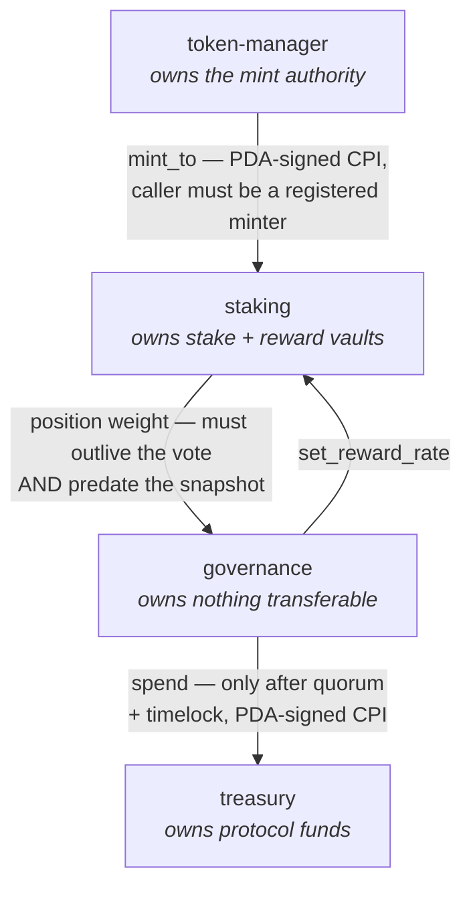

# Helix Protocol

A composable token, staking, governance and treasury suite for Solana, written in
Rust with the Anchor framework.

[](https://github.com/NarekYeghishyan/Helix-Protocol/actions/workflows/ci.yml)
[](https://www.anchor-lang.com)
[](https://solana.com)
[](./LICENSE)

> **Status: unaudited. Not deployed.** All four programs build to BPF and pass 178 tests
> locally, including runtime tests that execute the full governance → treasury authority
> chain and a real Token-2022 mint with transfer fees. The analytics stack and a devnet
> deployment are scoped in [ROADMAP.md](./docs/ROADMAP.md). Nothing here has held real
> value. See [SECURITY.md](./SECURITY.md).

Four programs that compose into one system. Nothing here wraps an existing protocol —
the reward accounting, the vote-weight mechanism and the governance state machine are
implemented from scratch, and the reasoning behind each is written down in
[`docs/`](./docs).

| Program | Responsibility | Holds authority over | Unit tests |
|---------|---------------|---------------------|-----------|
| [`token-manager`](./programs/token-manager) | HLX mint (Token-2022), minter registry, epoch caps | The mint authority | 7 |
| [`staking`](./programs/staking) | Lock tiers, O(1) reward distribution | Stake + reward vaults | 24 |
| [`governance`](./programs/governance) | Proposals, voting, quorum, timelock | Nothing transferable | 17 |
| [`treasury`](./programs/treasury) | Protocol funds, vesting streams, spend limits | Treasury vault | 17 |



There is no address that can move treasury funds. `treasury` accepts spend instructions
from exactly one signer — the `governance` execution PDA — and `governance` will only
produce that signature after a proposal has passed quorum *and* cleared its timelock.
That chain is the security model.

---

## Three decisions worth reading the code for

**Reward distribution is O(1), not O(stakers) — and it is measured, not asserted.**
Rewards use a `reward_per_token` accumulator in u128 fixed point, the Synthetix/MasterChef
shape. No instruction iterates over the staker set. The naive alternative passes a
ten-staker test and then permanently bricks the pool at ten thousand, once distribution
exceeds the compute budget.

The benchmark reaches the same staked total two ways — 64 stakers holding one unit each, or
one staker holding 64 — and both cost **bit-identical compute**. Staker count differs by
64× and the number does not move, which is a stronger statement than any sweep alone can
make. → [`staking/src/state.rs`](./programs/staking/src/state.rs),
[`compute_budget.rs`](./tests/integration/tests/compute_budget.rs),
[compute table](./docs/TESTING.md#compute-cost).

**Voting takes two gates, and stateful fuzzing found the second one missing.** A position
may vote only if `lock_end >= proposal.voting_ends_at` — you can only vote with stake you
are unable to withdraw before the vote closes, so borrowed capital carries zero weight.
Stronger than a block snapshot, which can be gamed by borrowing *before* the snapshot, and
it costs one comparison.

That gate proves commitment forward in time. It says nothing about membership backward in
time, and the fuzzer found weight staked *after* a proposal opened voting anyway —
inflating the quorum numerator against a denominator fixed at activation. Locked for 180
days, so the flash-loan gate waved it through. Every hand-written governance test had
staked its voters before activating, because that is the order a person writes.
[F-10](./docs/SECURITY-ASSESSMENT.md#f-10--post-snapshot-weight-could-vote), High, fixed. →
[`vote.rs`](./programs/governance/src/instructions/vote.rs),
[`fuzz.rs`](./tests/integration/src/fuzz.rs),
[threat model](./docs/THREAT-MODEL.md#a1--flash-loan-governance-capture).

**Token-2022 transfer fees are accounted for — and proven so.** When a mint carries the
transfer-fee extension, the amount sent is not the amount that arrives. Every deposit path
credits the *observed vault balance delta*, never the `amount` argument.

This is invisible on a plain SPL mint, where the two are identical — so the whole unit
suite passes either way. It is verified by running the staking flow against a real
fee-bearing mint, and that test was **mutation-tested**: reverting the fix produces a
30,000-unit shortfall between positions and vault, while the plain-mint test stays green.
→ [`staking_transfer_fee.rs`](./tests/integration/tests/staking_transfer_fee.rs),
[invariants](./docs/INVARIANTS.md#2-token-2022-transfer-fees).

## Documentation

Structured as the five deliverables of an architecture-and-enhancement engagement.

| | Deliverable |
|---|---|
| [ARCHITECTURE-REVIEW.md](./docs/ARCHITECTURE-REVIEW.md) | **1 — Architecture review.** The review method, and it applied to this codebase: strengths, weaknesses, scalability limits, improvement opportunities |
| [SECURITY-ASSESSMENT.md](./docs/SECURITY-ASSESSMENT.md) | **2 — Security assessment.** Access-control matrix, risk register with severities, recommended mitigations |
| [ROADMAP.md](./docs/ROADMAP.md) | **3 — Technical roadmap.** Prioritised phases, milestones, estimates, and an explicit list of what is *not* built |
| [ARCHITECTURE.md](./docs/ARCHITECTURE.md) | **4 — Enhancements.** How the four programs compose and why each design choice was made |
| [INVARIANTS.md](./docs/INVARIANTS.md) · [TESTING.md](./docs/TESTING.md) · [RUNBOOK.md](./docs/RUNBOOK.md) | **5 — Documentation.** Invariants mapped to tests, testing procedures, deployment runbook |
| [AUDIT-READINESS.md](./docs/AUDIT-READINESS.md) | Self-audit: which technique found which finding, what an auditor need not re-derive, and the brief |
| [THREAT-MODEL.md](./docs/THREAT-MODEL.md) | Attacks defended, trust assumptions, and what is explicitly out of scope |

## Quick start

Requires Linux or WSL2 — the Solana BPF toolchain does not build natively on Windows.

```bash
# One-time toolchain setup (Rust, Solana CLI, Anchor, Node)
bash scripts/bootstrap-wsl.sh

# Program keypairs (gitignored; generated once per developer)
node scripts/gen-program-keys.mjs
anchor keys sync

anchor build
cargo test --workspace
```

Toolchain: Anchor 1.1.2, Solana 3.1.10, Rust stable. See
[RUNBOOK.md](./docs/RUNBOOK.md) for deployment.

## Repository layout

```text
programs/
  token-manager/   HLX mint, minter registry, two-step admin transfer
  staking/         lock tiers, reward accumulator, position accounting
  governance/      proposal lifecycle, lock-gated voting, timelock
  treasury/        vault, vesting streams, per-epoch spend limits
indexer/           event decoding, reorg-safe ingestion, state projection
tests/integration/ runtime tests against the real BPF programs via LiteSVM
scripts/           toolchain bootstrap, program keys, documentation link check
docs/              the five deliverables above
.github/workflows/ fmt, clippy -D warnings, doc links, cargo-audit, build, test
```

`package.json` is scaffolding for the Phase 5 dashboard. There are no TypeScript sources
yet, so CI does not pretend to lint any.

## Testing

```bash
anchor build 2>&1 | tee build.log
grep -i "stack offset" build.log   # must be empty — anchor build exits 0 even when it isn't
cargo test --workspace             # 178 tests: unit + doc + runtime
cargo clippy --workspace --all-targets -- -D warnings
cargo fmt --all -- --check
```

**97 unit tests** cover the reward accumulator, vesting schedule, tally arithmetic and
every state machine directly — including a differential check that fixed-point rounding
never favours the user over the pool.

**81 runtime tests** ([`tests/integration/`](./tests/integration)) execute the real BPF
programs against the real Token-2022 program via LiteSVM: the full authority chain (a
passed, timelocked proposal moving treasury funds), the staking withdrawal paths, and a
negative test for each attack in the [threat model](./docs/THREAT-MODEL.md) — direct
treasury calls, pre-timelock execution, double execution, double voting, flash-staked
voting, and substituted destinations.

Of 57 documented invariants, **54 are verified, 3 untested** — tracked row by
row in [INVARIANTS.md](./docs/INVARIANTS.md). That table is kept honest deliberately: a
claim no test can falsify is documentation, not a guarantee.

Writing those tests found a real architectural hole. Vesting, the treasury spend cap and
governance migration were all **unreachable on chain** — governance had no `ProposalAction`
variant that produces the executor signature for them. Every unit test passed and the code
compiled; the gap was in what governance is *able to ask for*.
[F-8](./docs/SECURITY-ASSESSMENT.md#f-8--governance-gated-treasury-instructions-are-unreachable).

## Analytics

[`indexer/`](./indexer) reconstructs protocol state from the event stream — and proves it
matches. Real transactions, the runtime's own logs, and the resulting projection compared
to the accounts those transactions wrote, field by field
([`indexer_reconciliation.rs`](./tests/integration/tests/indexer_reconciliation.rs)).

It is written in Rust and links the program crates directly, so the event types *are* the
programs' types and derived figures use the programs' arithmetic. A client that re-declares
the schema from an IDL has a second copy to keep in sync, and nothing compares them.

Building it found that `Unstaked` was not self-sufficient: reconstructing
`pool.total_weighted` meant re-running the lock-tier table off chain, which would agree with
the program until the day the table changed. The rule it produced — **an event that cannot
be folded into state without recomputation is an incomplete event** — now applies to all 34.

## License

Apache-2.0. See [LICENSE](./LICENSE).
