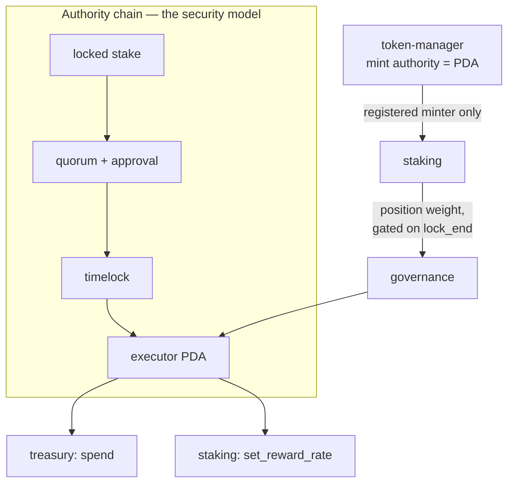

# Architecture review

*Deliverable 1 — current architecture, strengths and weaknesses, scalability
considerations, improvement opportunities.*

Two things live here. First the **method** — the order I review a Solana codebase in and
what I look for at each step, which is the part that transfers to any codebase. Then the
method **applied to Helix itself**, findings and all, because a review framework that has
not produced findings on the author's own code is untested.

---

## Part 1 — Method

### Order of work

Reviewing in this order means each pass answers questions the next one depends on. The
biggest mistake is starting with the code: without the authority map you cannot tell
which code matters.

| Pass | Question | Output |
|---|---|---|
| 1 | What can move value, and who can make it happen? | Authority map |
| 2 | What must always be true? | Invariant list |
| 3 | Where does the arithmetic decide who gets paid? | Rounding audit |
| 4 | What grows without bound? | Scalability limits |
| 5 | What does the test suite actually prove? | Coverage gap |
| 6 | What happens on deploy day and upgrade day? | Operational risk |

**Pass 1 is the one that finds the severe issues.** Enumerate every instruction that
moves tokens or changes an authority, then trace backwards to every signer that can reach
it. Anything reachable by an unexpected party is a finding; anything reachable *only*
through a chain you can state in one sentence is the design working.

**Pass 5 is the one people skip.** A green suite says nothing until you ask what a test
would notice if a specific line were reverted. Coverage percentage is close to useless
here — the question is whether the *properties* are pinned.

### Solana-specific checklist

The items that generalise poorly from other ecosystems, and where most real defects live.

**Account validation**
- [ ] Every `AccountInfo` / `UncheckedAccount` carries a `/// CHECK:` stating what
      validates it. Reviewers grep for these; each should answer its own question.
- [ ] Typed `Account<T>` wherever the type is knowable — it checks the owning program for
      free, which is what stops a look-alike account with forged fields.
- [ ] `has_one` on every stored relationship, rather than a handler-side comparison that
      can be forgotten in the next instruction.
- [ ] Bumps stored at init and passed on every later use, so only canonical bumps are
      accepted.
- [ ] PDA seeds fixed-length or length-prefixed. Raw concatenated user strings are a
      collision vector.

**Signers and authority**
- [ ] Every privileged instruction requires a `Signer`, not just a matching pubkey.
- [ ] Authority handovers are two-step, with the successor signing. One-step transfer to
      a mistyped address is unrecoverable.
- [ ] Initialisers cannot be front-run into installing the wrong authority — the PDA is
      seeded by something the attacker cannot control, or the deployer is gated, or
      bootstrap is atomic.
- [ ] A "guardian" or "pause" role can only *prevent*, never *cause*.
- [ ] Pausing cannot trap user funds. A pause that blocks withdrawals is indistinguishable
      from a freeze.

**Arithmetic**
- [ ] `checked_*` at every site, with `overflow-checks = true` as a backstop rather than
      the plan.
- [ ] `u128` intermediates before narrowing, and `try_from` on the way back down.
- [ ] Every division has a documented, tested rounding direction that favours the
      protocol.
- [ ] Ratio comparisons cross-multiplied rather than divided, so thresholds lose nothing
      to truncation.
- [ ] Fixed-point scale justified against the worst-case product, not chosen by habit.

**Compute and account limits**
- [ ] No instruction iterates over a set that users can grow. This is the classic Solana
      failure: correct at 10 users, permanently stuck at 10,000.
- [ ] **SBF stack frames under 4KB.** Large accounts `Box`ed. `anchor build` reports
      overflows and exits 0 anyway, so the build log must be grepped.
- [ ] Account sizes computed by `InitSpace`, not hand-counted constants.
- [ ] Transaction account count and size within limits for the realistic worst case.

**Token-2022**
- [ ] `InterfaceAccount` + `Interface<TokenInterface>` rather than hardcoding a token
      program.
- [ ] **Deposits credit the observed balance delta, not the `amount` argument.** With the
      transfer-fee extension the two differ, and crediting the argument breaks solvency.
      Invisible on a plain SPL mint.
- [ ] `transfer_checked` rather than `transfer`.
- [ ] A decision recorded about extensions that break assumptions — confidential
      transfers, transfer hooks, non-transferable, default account state.

**Lifecycle and replay**
- [ ] Closed accounts cannot be re-initialised to replay historical entitlements.
- [ ] State transitions are set *before* any CPI, so a re-entrant call cannot observe a
      stale state.
- [ ] Anything queued has an expiry, so it cannot execute into a world that no longer
      matches the conditions it was approved under.

**Operational**
- [ ] Upgrade authority destination decided, documented, and verified — not assumed.
- [ ] Verifiable builds, so "the source is on GitHub" is checkable.
- [ ] Events on every state transition, with an on-chain timestamp, so history is
      reconstructable without polling.
- [ ] One error variant per failure mode. The error enum is the operator's only
      diagnostic when a mainnet transaction fails.

---

## Part 2 — Applied to Helix

Scope: the four programs at commit time. Findings with IDs cross-reference
[SECURITY-ASSESSMENT.md](./SECURITY-ASSESSMENT.md).

### Current architecture

Four programs, each owning exactly one concern and one class of asset, composed through
PDA signatures rather than shared admin keys.

The single most important structural property: **no address can move treasury funds.**
`treasury` accepts one signer, `governance` produces it only inside a passed and
timelocked proposal, and the chain has no other inbound edge.

### Strengths

**The authority chain is stateable in one sentence and enforced in one place.** That is
the property that makes the rest reviewable. `treasury.governance_executor` is read by
exactly one constraint; the pool's `authority` likewise. There is no second path, no
admin override, and `set_governance_executor` is callable only by the current executor —
so migrating governance is itself an act of governance.

**Reward distribution is O(1).** The `reward_per_token` accumulator means no instruction
iterates over stakers, so compute is flat in pool size. This is the difference between a
protocol that works at scale and one that bricks at scale, and it was a design choice
rather than an optimisation.

**Flash-loan resistance is structural, not bolted on.** `lock_end >= voting_ends_at` costs
one comparison and is strictly stronger than a snapshot, which can be gamed by borrowing
before the snapshot block. It is cheap *because* the staking design was chosen to make it
cheap — the lock tiers exist for reward weighting anyway.

**Rounding direction is deliberate and tested everywhere.** Each division has a test
pinning which side benefits. The differential test against exact arithmetic is the right
shape for this: it compares the implementation to a specification rather than to itself.

**Time is a parameter, not a `Clock` read.** Pure functions take `now: i64`. This makes
the entire time dimension unit-testable without a validator, which is why boundary cases
like "same timestamp twice" and "stale timestamp" are covered at all.

**Governance actions are a closed enum.** A voter reads a variant instead of decoding
instruction bytes. Less general than arbitrary-CPI governance and much easier to reason
about, and the trade-off is written down rather than left implicit.

**The docs record reasoning, not just shape.** For a codebase that will be handed over,
the reason a choice was made is the part that is expensive to reconstruct and impossible
to infer.

### Weaknesses

Ordered by how much I would want them fixed before this held value.

**W-1 — Cross-program behaviour is unverified at runtime (F-4).** The most serious
weakness, and it is a weakness of the *engineering process*, not the design. Every CPI
path type-checks; none has been executed. Invariant §2.1 is the sharpest case: on a plain
SPL mint, crediting the delta and crediting the argument are identical, so no current test
would notice the correct behaviour being removed. **A claim no test can falsify is
documentation, not a guarantee.**

**W-2 — Initialisers are front-runnable (F-1).** Three of four take the privileged party
as an unchecked argument, first-caller-wins, with PDAs seeded by mints. Mitigable
operationally via atomic bootstrap, but the stronger fix is gating on the deployer, and
the current design leaves a real window. The interesting part is *why it happened*: the
authority model was reviewed thoroughly for the steady state and not at all for the
transition into it.

**W-3 — The liability bug (F-2) points at a systematic gap.** `unpaid_liability` used
deposits as liability, which made the solvency guard reject every non-zero reward rate —
the pool could never have paid rewards. Both halves were individually tested and
individually correct; the defect was in their composition. The gap is a habit: testing
inputs to a predicate rather than the predicate.

**W-4 — Invariants are asserted at the wrong level.** The aggregate invariants (§1.1
`Σ position.amount == vault.amount`, §1.3, §1.4) are the ones that catch real accounting
drift, and they can only be checked against actual accounts. Unit tests cannot reach them.
So the invariants that matter most are precisely the ones with no test.

**W-5 — Compute claims were argued, not measured. Now measured.** §6.3 asserted flat
compute against staker count, which followed from the absence of loops. That is a weaker
claim than a benchmark, and CU consumption has non-obvious contributors. Benchmarked in
[`compute_budget.rs`](../tests/integration/tests/compute_budget.rs): the claim holds, with
one qualification the code reading would not have produced. `claim` and `unstake` move
slightly with the *magnitude* of the accumulated fixed-point values, because SBF has no
native `u128` arithmetic and the software routines LLVM emits cost more on wider operands.
Reaching the same staked total with 64 stakers or with one costs bit-identical compute, so
the count genuinely is not a variable — but "flat" was the wrong word for what is really
"logarithmic in staked value, constant in staker count". See
[TESTING.md](./TESTING.md#compute-cost).

**W-6 — Token metadata is not initialised.** The mint is Token-2022 but has no on-chain
name or symbol, needing the metadata extension CPI plus a realloc for variable-length
fields. Cosmetic for the protocol, immediately visible in every wallet.

**W-7 — `Position` accounts are never closed.** Rent is not reclaimed on full exit. No
security impact; a real cost at scale and a papercut for users.

### Scalability considerations

**What scales well.** Reward distribution is O(1) per user with no shared hot account
beyond the pool. Vote tallying is a running total. Governance reads a single position per
vote. Per-user state is in per-user PDAs, so there is no monolithic account whose size
grows with usage — the pattern that most often forces a painful migration later.

**Where the real limits are.**

| Limit | When it bites | Mitigation |
|---|---|---|
| Pool account write contention | Every `stake`/`unstake`/`claim` writes `Pool`, so pool-level throughput is bounded by sequential access to one account | Inherent to a shared accumulator. Shard into multiple pools per mint pair if it binds; the accumulator design makes this a config change, not a rewrite |
| Position proliferation | A user with many positions pays rent per position and must transact per position | Cap positions per user, or add a merge instruction |
| Voting across many positions | A holder with N positions sends N vote transactions | Acceptable; the alternative is an aggregate record with staleness bugs |
| Indexer throughput | Event volume grows with users; ingestion must be idempotent under redelivery | Designed for — every event carries an on-chain timestamp |
| Governance account growth | Proposals and vote records accumulate permanently | Close vote records after execution to reclaim rent |

**The honest headline:** the pool account is the throughput ceiling, and that is a
deliberate trade. A shared accumulator is what buys O(1) distribution; the cost is that
every position change touches one account. For a staking protocol this is the right side
of the trade — stake operations are not high-frequency.

Compute is no longer the constraint to worry about there: the busiest instruction in the
system uses 17.9% of the default per-instruction budget, and none of them grow with the
staker set. What remains unmeasured is *write contention* on the pool account under
concurrent load, which needs a real validator rather than an in-process runtime — Phase 3.

### Improvement opportunities

Prioritised by value per unit of effort.

| # | Opportunity | Effort | Why |
|---|---|---|---|
| 1 | Integration tests, fee-bearing mint first | 4–6d | Converts most claims in these docs from assertions into facts. Nothing else is worth doing first |
| 2 | Runtime invariant assertions in test fixtures | 1.5d | Reaches W-4 — the aggregate invariants that unit tests structurally cannot |
| 3 | Atomic bootstrap + post-deploy verification | 1d | Closes W-2 at deployment time |
| 4 | Compute-unit benchmarks vs. staker count | 1d | Turns W-5 from an argument into a measurement |
| 5 | Close `Position` and `VoteRecord` on completion | 1d | Reclaims rent; removes W-7 |
| 6 | Token metadata extension | 0.5d | W-6; cheap and immediately visible |
| 7 | Trident fuzzing with invariants as oracle | 3.5d | Finds what hand-chosen inputs miss |
| 8 | Deployer-gated initialisers | 0.5d | Stronger form of W-2, worth taking on any redeploy |

Sequenced with estimates in [ROADMAP.md](./ROADMAP.md).

### What I would want before reviewing someone else's codebase

For a real engagement, the review above required only the source. Doing it well on an
unfamiliar codebase additionally needs:

1. **Deployed program IDs and cluster**, so the review covers what is actually running
   rather than what is on `main`. These diverge more often than anyone expects.
2. **Who holds the upgrade authority, and where those keys live.** This usually dominates
   the risk assessment, and it is a question about people, not code.
3. **The mint, and which Token-2022 extensions are enabled.** Changes what the deposit
   paths must handle.
4. **Existing test suite and CI config** — the coverage gap is a finding in itself.
5. **Whether value is already at risk.** It changes the ordering completely: with live
   funds, the front-running class of finding stops being a deployment note and becomes
   urgent.
6. **Any prior audit reports**, so review effort goes to new ground rather than
   re-deriving known findings.
