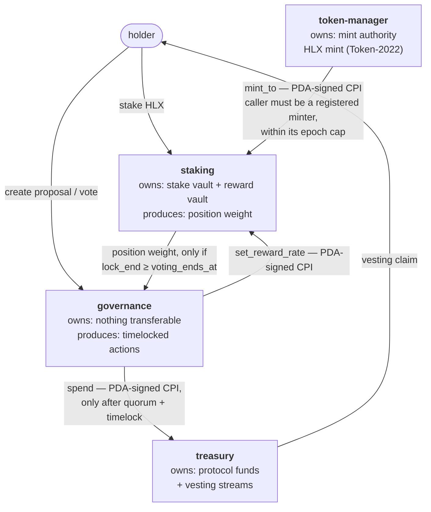
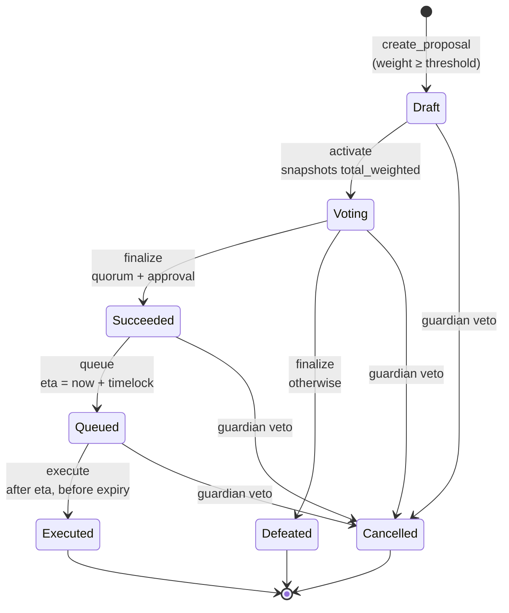

# Architecture

Helix is four Anchor programs that compose into one system. The composition is the
point: each program owns exactly one concern and holds authority over exactly one
class of asset, and they reach each other through PDA signatures rather than through
shared admin keys.



There is no address that can move treasury funds directly. `treasury` accepts spend
instructions from exactly one signer — the `governance` program's proposal-execution
PDA — and `governance` will only sign after a proposal has passed quorum *and* cleared
its timelock. That chain is the security model.

---

## 1. token-manager

Creates and governs the HLX mint.

- The mint authority is a PDA (`["mint_authority", config]`), so no human key can mint.
- A **minter registry** gates `mint_to`: only programs/addresses recorded in the config
  may request an issuance, and each has an independent per-epoch cap.
- Admin transfer is **two-step** (`propose_admin` → `accept_admin`). A single-step
  transfer to a typo'd address is unrecoverable; this is a small change that removes a
  whole class of fatal operator error.
- The mint is **Token-2022**, created with a metadata pointer extension pointing at
  itself.

### Why Token-2022 rather than the legacy token program

Token-2022 is where the ecosystem is going, and it forces the implementation to be
honest about a detail most portfolio code gets wrong: with the transfer-fee extension
active, **the amount you send is not the amount that arrives**. Every deposit path in
`staking` therefore credits the balance delta observed on the vault, never the amount
argument. See [INVARIANTS.md](./INVARIANTS.md) §2.

---

## 2. staking

The centrepiece, and the part worth reading first.

### Reward accounting

Rewards accrue continuously at `reward_rate` (tokens per second) and are split across
stakers in proportion to **weighted** stake. The implementation uses a
reward-per-token accumulator, so distribution costs O(1) per user and the program
never iterates over the staker set.

```
PRECISION = 1e12   (u128 fixed point)

update_pool(now):
    if total_weighted > 0:
        elapsed  = now - last_update_ts
        emitted  = elapsed * reward_rate
        reward_per_token += (emitted * PRECISION) / total_weighted
    last_update_ts = now

earned(position):
    delta = reward_per_token - position.reward_per_token_paid
    position.pending + (position.weighted_amount * delta) / PRECISION
```

Every mutating instruction calls `update_pool` **before** touching balances, then
settles the position's `pending` and snaps `reward_per_token_paid` to the current
accumulator. This is the same shape as Synthetix `StakingRewards` / MasterChef, and
it is the reason the program has no unbounded loop anywhere.

An implementation that instead loops over stakers to pay them is the single most
common failure in staking code: it works with 10 stakers in a test and bricks the pool
at 10,000 when the transaction exceeds the compute budget. There is no such loop here.

**Rounding.** Both divisions truncate. Truncation in `reward_per_token` and in
`earned` both round *down*, which means the pool retains dust rather than paying out
more than it emitted. The direction is deliberate and asserted in tests: a rounding
error that favours the user is a slow drain of the reward vault.

### Lock tiers

| Tier | Lock | Weight |
|------|------|--------|
| Flexible | none | 1.00× |
| Bronze | 30 days | 1.25× |
| Silver | 90 days | 1.50× |
| Gold | 180 days | 2.00× |

`weighted_amount = amount * weight_bps / 10_000`. Weight drives both reward share and
governance vote power, which ties long-term alignment to influence.

Positions are individual accounts (`["position", pool, owner, position_id]`), so a
user can hold several tiers at once. Governance reads a position directly rather than
through an aggregate record: a vote is cast *by a position*, not by a wallet, which
keeps the tally O(1) and removes a whole class of staleness bug that an incrementally
maintained voter-weight account would introduce. A holder with three positions casts
three votes; the weights sum to the same total.

### Unstaking

`unstake` before `lock_end` is rejected outright rather than penalised. An early-exit
penalty sounds friendlier but creates a second reward-bearing balance that has to be
accounted for; refusing is simpler and simpler is auditable. `claim` is always
available regardless of lock state — locking your principal should not lock your yield.

---

## 3. governance

### Vote weight, and why flash loans do not work here

The standard attack on token governance: borrow a large balance, vote, repay, all in
one transaction. Two common defences are snapshots (expensive on Solana — you need
historical state) and vote-escrow.

Helix uses a third, which falls out of the staking design for free:

> A position may only vote on a proposal if `position.lock_end >= proposal.voting_ends_at`.

You can only vote with stake you are contractually unable to withdraw before the vote
closes. A flash-loaned position has `lock_end == now` and is rejected. No snapshot
history, no extra accounts, and the rule is one comparison — the kind of defence that
is cheap precisely because the surrounding design was chosen to make it cheap.

### Lifecycle



There is no `Expired` state. Once the grace period elapses, `execute` simply refuses and
the proposal remains `Queued` forever — inert, but still on chain. Adding a state would
require someone to pay for a transaction to mark it, which nobody has an incentive to do,
so the state would be unreliable exactly when it mattered.

`activate`, `finalize`, `queue` and `execute` are all permissionless: each is a pure
function of state already on chain, so there is nothing to decide, only to record. Gating
them would let whoever held the permission strand a proposal they disliked forever.

- **Quorum**: `for + against + abstain >= quorum_bps` of total weighted stake.
- **Approval**: `for > against` and `for >= approval_bps` of (`for + against`).
  Abstain counts toward quorum but not approval — the standard Compound/OZ semantics.
- **Timelock**: `Succeeded → Queued` sets `eta = now + timelock_delay`. Nothing
  executes before `eta`. This is the window in which users who dislike a passed
  proposal can exit, and the reason a timelock exists at all.
- **Guardian**: may cancel any proposal before execution, and may not do anything else.
  A guardian that can also *pass* proposals is not a safety mechanism, it is an admin key.

`VoteRecord` PDAs (`["vote", proposal, position]`) make double-voting a
`init`-constraint failure rather than a runtime check. Seeding by position rather than
by wallet is what allows a multi-position holder to vote their full weight while still
making each position's vote exactly once-only.

---

## 4. treasury

Holds protocol funds and vesting streams.

- The vault authority is `["treasury_authority", config]`, and the config records a
  single `governing_program` + `governance_realm`. Spend instructions verify the
  caller is the governance execution PDA for that realm.
- **Vesting streams**: linear release with an optional cliff, created only by
  governance, claimable only by the beneficiary, revocable only by governance. Claimed
  amounts are tracked so a revoke cannot claw back already-vested tokens.
- **Per-epoch spend limit** as a defence in depth: even a passed malicious proposal
  cannot drain the treasury in one transaction. It buys time for the guardian and for
  users to exit.

---

## Cross-cutting decisions

**Checked arithmetic everywhere.** `overflow-checks = true` in the release profile, and
every arithmetic site uses `checked_*` with an explicit error rather than relying on
the profile. The profile setting is a backstop, not the design.

**Typed accounts over `AccountInfo`.** `AccountInfo` appears only where a program
genuinely cannot know the type, and every occurrence carries a `/// CHECK:` comment
stating what validates it. Reviewers grep for `AccountInfo`; each one should answer
its own question.

**Large accounts are `Box`ed.** Anchor generates a `try_accounts` that deserialises
every account in a struct into one stack frame, and SBF allows 4KB per frame.
Token-2022 `Mint`/`TokenAccount` states are big enough that five of them in a single
instruction overflow it:

```text
Stake::try_accounts       — 4104 > 4096
Unstake::try_accounts     — 4336 > 4096
ClaimStream::try_accounts — 4104 > 4096
```

The reason this matters more than it looks: `anchor build` prints these as `Error:` and
then **exits 0 anyway**, emitting a `.so` that "builds fine" and may corrupt memory at
runtime. Boxing moves the deserialised accounts to the heap. CI greps the build log for
`stack offset` rather than trusting the exit code.

**Events on every state transition**, each carrying an on-chain timestamp so replaying the
log is deterministic. This is what lets an indexer reconstruct history rather than only
the present state, without polling accounts. The indexer and dashboard that consume them
are Phases 4 and 5 of [ROADMAP.md](./ROADMAP.md) and are not built yet — the events exist
first because retrofitting them later means losing all history before the retrofit.

**Errors are specific.** One variant per failure mode, not a general `InvalidArgument`.
An error enum is the program's user interface when something goes wrong.
