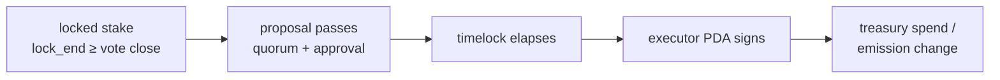

# Security assessment

*Deliverable 2 — smart contract security review, access control analysis, risk
assessment, recommended mitigations.*

**Scope:** the four programs under [`programs/`](../programs) at commit time.
**Method:** manual review of every instruction's authority checks and arithmetic;
invariant derivation ([INVARIANTS.md](./INVARIANTS.md)); adversarial modelling
([THREAT-MODEL.md](./THREAT-MODEL.md)); `cargo clippy -D warnings`; `cargo audit`.
**Not performed:** external audit, fuzzing, formal verification, runtime testing of
cross-program flows. See [Limitations](#limitations-of-this-assessment) — they are
material.

---

## 1. Access control analysis

Every instruction, its required authority, and the mechanism enforcing it.

### token-manager

| Instruction | Authority | Enforced by |
|---|---|---|
| `initialize_token` | anyone, once per mint | `init` on a PDA seeded by the mint; the mint is a fresh keypair signer |
| `register_minter` | admin | `has_one = admin` + `Signer` |
| `update_minter` / `revoke_minter` | admin | `has_one = admin` + `Signer` |
| `mint_tokens` | a registered minter | `Minter` PDA seeded by authority + `has_one = authority` + `Signer`, then epoch cap |
| `burn_tokens` | token owner | `token::authority = owner` + `Signer` |
| `propose_admin` / `cancel_admin_transfer` | admin | `has_one = admin` + `Signer` |
| `accept_admin` | pending admin only | `pending_admin` compared to a `Signer` |
| `set_paused` | admin | `has_one = admin` + `Signer` |

**Mint authority is held by a PDA** (`["mint_authority", config]`). No keypair can mint.
Verified: the only `mint_to` CPI in the crate is in `issuance.rs` and is reachable only
through the minter registry.

### staking

| Instruction | Authority | Enforced by |
|---|---|---|
| `initialize_pool` | anyone, once per mint pair | `init` on a PDA seeded by both mints — **see F-1** |
| `stake` | any holder | `Signer`; blocked by `paused` |
| `unstake` | position owner | `has_one = owner` + `Signer`, `lock_end` check; **not** blocked by pause |
| `claim` | position owner | `has_one = owner` + `Signer`; never blocked |
| `fund_rewards` | anyone | intentionally permissionless — funding only benefits stakers |
| `set_reward_rate` | pool authority | `has_one = authority` + `Signer`, then solvency check |
| `set_paused` | pool authority | `has_one = authority` + `Signer` |
| `accept_authority` | pending authority only | compared to a `Signer` |

### governance

| Instruction | Authority | Enforced by |
|---|---|---|
| `initialize_realm` | anyone, once per pool | `init` on a PDA seeded by the pool — **see F-1** |
| `update_realm_params` | realm authority | `has_one = authority` + `Signer` |
| `create_proposal` | holder ≥ `min_weight_to_propose` | position `has_one = owner`, owner must equal the signer, weight compared |
| `activate_proposal` | **anyone** | intentional; pure function of chain state |
| `cast_vote` | position owner | owner constraint + `Signer` + **lock gate** + `init` on the vote record |
| `finalize_proposal` / `queue_proposal` | **anyone** | intentional; pure functions of chain state |
| `cancel_proposal` | guardian | `has_one = guardian` + `Signer`, and `is_cancellable()` |
| `execute_*` | **anyone**, after `eta` | intentional; the timelock and state machine are the gate |

Permissionless `activate`/`finalize`/`queue`/`execute` is a deliberate choice. Each is a
pure function of state already on chain, so there is nothing to decide, only to record.
Gating them would let whoever held the permission strand a proposal they disliked
forever — a liveness risk strictly worse than the griefing it would prevent.

**The guardian can only cancel.** Verified by inspection: `realm.guardian` is read in
exactly one instruction.

### treasury

| Instruction | Authority | Enforced by |
|---|---|---|
| `initialize_treasury` | anyone, once per mint | `init` on a PDA seeded by the mint — **see F-1** |
| `deposit` | anyone | intentionally permissionless |
| `spend` | governance executor | `has_one = governance_executor` + `Signer`, epoch cap, uncommitted-balance check |
| `create_stream` / `revoke_stream` | governance executor | `has_one` + `Signer` |
| `claim_stream` | beneficiary | `has_one = beneficiary` + `Signer` |
| `set_spend_cap` | governance executor | `has_one` + `Signer` |
| `set_governance_executor` | **current** executor | `has_one` + `Signer` — no admin override |

### Authority reachability

The property the whole design rests on:



There is no other inbound edge to `S`. Confirmed by grepping for every use of the
treasury's `governance_executor` and the pool's `authority`.

---

## 2. Findings

Severity = impact × likelihood, CVSS-style but judged rather than computed.

| ID | Finding | Severity | Status |
|---|---|---|---|
| F-1 | Initialisers are front-runnable | **Medium** | Open — mitigated operationally |
| F-2 | `unpaid_liability` used deposits as liability, making any non-zero reward rate unsettable | **High** | **Fixed** |
| F-3 | SBF stack frame overflow in three `Accounts` structs | **High** | **Fixed** |
| F-4 | Cross-program flows unverified at runtime | **High** | Largely resolved — authority chain verified end to end; staking withdrawal and vesting remain |
| F-5 | Upgrade authority not migrated to governance | **Critical** (if deployed) | Open — Phase 7 |
| F-6 | Guardian key compromise causes governance denial of service | **Low** | Accepted |
| F-7 | `Position` accounts are never closed | **Informational** | Open |
| F-8 | Vesting, spend-cap and executor-migration instructions are unreachable | **Medium** | **Fixed** — found by attempting to test them |
| F-9 | Token-manager admin cannot be handed to governance | **Low** | **Fixed** — same class as F-8 |

### F-1 — Initialisers are front-runnable

**Severity:** Medium · **Status:** open

`initialize_pool`, `initialize_realm` and `initialize_treasury` each create a PDA seeded
by mints or by the pool, and take the privileged party (`authority`, `guardian`,
`governance_executor`) as an *unchecked account argument*. The first caller wins.

An observer watching a deployment can therefore initialise any of the three between
program deploy and the operator's bootstrap transaction, naming themselves as authority.
The PDA is then permanently occupied: the seeds are derived from the mint, so recovery
means deploying a new mint and abandoning the old address.

`initialize_token` is **not** affected — its config PDA is seeded by a mint created in
the same instruction as a fresh keypair signer, so an attacker cannot target it.

**Recommended mitigations**, in order of preference:

1. **Bootstrap atomically.** Run all three initialisers in a single transaction
   immediately after deploy, so no window exists.
2. **Gate on a known deployer.** Compare the payer against a compile-time constant, or
   against the program's own upgrade authority, and reject otherwise.
3. **Verify after bootstrap.** Assert the on-chain authorities match what was intended —
   this belongs in the runbook regardless of 1 and 2.

**(1) is now measured, not assumed.** A recommendation to "do it atomically" is worthless
if the transaction does not fit: Solana caps a packet at 1232 bytes and roughly three
dozen accounts.
[`bootstrap_atomicity.rs`](../tests/integration/tests/bootstrap_atomicity.rs) builds the
real transaction and measures it:

```text
bootstrap transaction: 748 bytes, 17 accounts
```

Comfortable headroom, and the test asserts the limit so it fails if the bootstrap ever
grows past it. A companion test confirms that once bootstrapped, an attacker's
`initialize_pool` against the same mint fails and the authority is unchanged.

Measuring it also produced a better design than the one originally written into the
runbook. `initialize_pool` and `initialize_treasury` take the privileged party as an
*argument*, so the bootstrap can name the realm's executor PDA directly at
initialisation — **there is never a moment when a human key controls emissions or the
treasury**, and the two-step authority handover the runbook prescribed for them is
unnecessary. It remains necessary only for the token-manager admin, which has a genuine
chicken-and-egg: registering the staking program as a minter must happen before
governance can be asked to do anything.

Severity stays Medium: the window is short, the exploit immediately visible, and no user
funds exist at that point. (2) remains the stronger fix and is worth taking on any
redeploy.

### F-2 — Reward liability computed from deposits

**Severity:** High · **Status:** fixed

`Pool::unpaid_liability` returned `total_rewards_funded - total_rewards_paid`. Because
the reward vault balance is *itself* approximately `funded - paid`, the solvency guard in
`set_reward_rate`:

```text
unpaid_liability + committed_emission <= reward_vault.amount
```

collapsed to `committed_emission <= 0`, rejecting every non-zero rate. **The pool could
never have paid rewards at all**, and the failure would have presented as a
configuration problem rather than an accounting one.

Fixed by tracking `total_rewards_accrued` — what has actually become claimable — and
accruing it as the accumulator advances.

A second, subtler error surfaced while fixing it: deriving the accrual per-update from
the truncated `delta` sums many floored divisions, while `earned()` performs one, and
`Σ floor(aᵢ) ≤ floor(Σ aᵢ)`. That *understates* liability, which is the unsafe direction
— it would let a rate be approved that the vault cannot cover. The accrual now books the
full `emitted` amount, over-stating debt by the retained dust. Regression tests:
`a_funded_pool_can_actually_set_a_nonzero_rate`, `liability_is_never_understated`.

**Lesson worth generalising:** both halves of this guard were unit-tested in isolation
and both were correct. The defect lived in their *composition*. Tests should assert the
predicate a handler actually evaluates, not just its inputs.

### F-3 — SBF stack frame overflow

**Severity:** High · **Status:** fixed

`Stake`, `Unstake` and `ClaimStream` generated `try_accounts` frames of 4104–4336 bytes
against a 4096-byte SBF limit. Anchor deserialises every account in a struct into one
frame, and Token-2022 `Mint`/`TokenAccount` states are large enough that five of them
overflow.

The dangerous part is the failure mode: `anchor build` prints these as `Error:` and
**exits 0**, emitting a `.so` that appears to build cleanly and may corrupt memory at
runtime. Fixed by boxing the large accounts. CI now greps the build log for
`stack offset` rather than trusting the exit code.

### F-4 — Cross-program flows unverified at runtime

**Severity:** High · **Status:** partially resolved

**Resolved:** the staking deposit path and the Token-2022 fee invariants (§1.1, §1.3,
§2.1–§2.3) now run against real BPF programs and a real fee-bearing mint under LiteSVM.

This was the sharpest instance of the finding, and worth recording why. On a plain SPL
mint, crediting the vault delta and crediting `amount` produce identical results, so the
entire 65-test unit suite passed either way — the correct behaviour could have been
deleted silently. Mutation testing confirmed the new tests have teeth: injecting the bug
fails three of them with a 30,000-unit shortfall between positions and vault, while the
plain-mint test stays green.

**Also resolved:** the authority chain in
[§1 Authority reachability](#authority-reachability) is now executed rather than read. A
passed, timelocked proposal moves treasury funds; a direct call to the treasury is
refused; execution before `eta` is refused; a proposal cannot execute twice; a guardian
can cancel and do nothing else; and a substituted destination is rejected because
execution reads its parameters from `proposal.action` rather than the caller.

The flash-loan defence (A1) is likewise now verified at runtime: an unlocked position five
times the size of the committed stake is refused with `InsufficientLockDuration` and
contributes zero weight.

**Still open:** staking's withdrawal lifecycle (accrue → claim → unlock → unstake) and
vesting token movement. Both are arithmetic that is unit-tested; what is unverified is the
token transfer and account-state bookkeeping around it. Lower risk than what was closed,
but not zero — `claim` and `unstake` are the paths users depend on to exit.

### F-5 — Upgrade authority not migrated

**Severity:** Critical if deployed · **Status:** open

Nothing is deployed, so this is currently theoretical. It becomes the dominant risk the
moment it is: whoever holds the upgrade authority can replace every guarantee in this
assessment. An unmigrated upgrade authority is the most common gap between "audited" and
"actually safe". Phase 7; [RUNBOOK.md](./RUNBOOK.md) treats it as an explicit,
verifiable step.

### F-6 — Guardian denial of service

**Severity:** Low · **Status:** accepted

A compromised guardian can veto every proposal indefinitely, freezing governance. It
cannot cause anything to happen — only prevent it. Accepted as the deliberate cost of
having a veto at all; mitigated by holding the guardian key in a multisig and by the
realm's ability to vote in a new one, provided a proposal can pass first.

### F-8 — Governance-gated treasury instructions are unreachable

**Severity:** Medium · **Status:** fixed

Four treasury instructions require a signature from `governance_executor`:

| Instruction | Reachable? |
|---|---|
| `spend` | ✅ via `execute_treasury_transfer` |
| `create_stream` | ❌ |
| `revoke_stream` | ❌ |
| `set_spend_cap` | ❌ |
| `set_governance_executor` | ❌ |

The executor PDA can only be produced inside a governance `execute_*` instruction, and
only three exist — `execute_signal`, `execute_treasury_transfer`,
`execute_set_staking_reward_rate`. `ProposalAction` has no variant reaching the other
four, so **no signature satisfying their constraint can ever be produced**.

Consequences:

- **The vesting subsystem is dead code on chain.** Streams can never be created, so
  `claim_stream` and `revoke_stream` are unreachable too. Nine unit tests cover arithmetic
  that no transaction can invoke.
- **The per-epoch spend cap is immutable after initialisation.** Set it wrong and it stays
  wrong.
- **Governance migration is impossible.** `programs/treasury/README.md` stated that
  migrating to a new governance program "is itself something the existing governance has
  to vote for". That was false — there is nothing to vote for. The README has been
  corrected pending the fix.

No funds are at risk: the failure mode is that features do not work, not that they work
wrongly. Rated Medium rather than Low because the missing migration path means a
superseded governance program cannot be replaced except by a program upgrade.

**How it was found matters.** It surfaced while writing the vesting runtime test — there
was no way to construct a transaction that creates a stream. Every unit test passed, the
code compiled, and the CPI wiring was correct. The gap was in what governance is *able to
ask for*, which is not a property any unit test observes.

**Fixed** by adding `CreateVestingStream`, `RevokeVestingStream`, `SetTreasurySpendCap`
and `SetGovernanceExecutor` to `ProposalAction`, each with its own `execute_*` instruction
following the `execute_treasury_transfer` pattern — typed accounts, parameters
destructured from `proposal.action` rather than taken from the caller, and a
`require_keys_eq!` on any account the proposal named.

Verified by twelve runtime tests in
[`vesting_e2e.rs`](../tests/integration/tests/vesting_e2e.rs), including the full
grant → cliff → claim → revoke cycle, that a revoke is forward-only, that a spend cannot
touch tokens committed to a stream (§1.6), and that a realm can hand its treasury to a
successor executor and then no longer spend from it. Those tests are themselves the
regression check: none of them can even be written if the variants are removed.

One design note from the fix. `CreateVestingStream` carries no `stream_id`, because the
correct id is the treasury's `stream_count` at *execution* time and is not knowable when
the proposal is written. It is supplied as an execution argument and validated by the
treasury against its own counter, so a caller cannot choose an arbitrary slot.

### F-9 — Token-manager admin cannot be handed to governance

**Severity:** Low · **Status:** fixed

The same shape as F-8, found the same way — by writing the deployment sequence down and
noticing a step that cannot be performed.

The token-manager admin must start as a human key: `register_minter` has to run before the
staking program can pay rewards, and only the admin can register a minter, so there is no
way to have governance do it first. The intended end state is to hand the admin to the
realm's executor PDA afterwards.

`accept_admin` requires the incoming admin to **sign**, and the executor PDA signs only
inside a governance `execute_*`. There is no `ProposalAction` variant for accepting a
token-manager admin transfer, so the handover cannot be completed.

Consequence: the mint's admin stays a multisig indefinitely. That admin can register
minters and pause issuance, but it cannot mint — the mint authority is a PDA no key holds
— so the blast radius is bounded. Rated Low for that reason, where F-8 was Medium.

Unlike the pool and treasury authorities, this one genuinely cannot be set at
initialisation, so it needs the missing variant rather than a bootstrap change.

**Fixed**, and deliberately more broadly than the finding described. Adding only
`AcceptTokenManagerAdmin` would have made the realm the admin *without any of the admin's
powers* — it could not register a minter, retune a cap or pause issuance — which is the
same defect again in a new place. The whole admin surface is now governable:
`AcceptTokenManagerAdmin`, `RegisterMinter`, `UpdateMinter`, `RevokeMinter`,
`SetTokenPaused` and `ProposeTokenAdmin`, in
[`execute_token.rs`](../programs/governance/src/instructions/execute_token.rs).

Verified by seven runtime tests in
[`token_admin_e2e.rs`](../tests/integration/tests/token_admin_e2e.rs), which follow the
real deployment order including the chicken-and-egg: the human admin registers the first
minter and mints the initial supply, *then* hands over. They assert the handover lands,
that the superseded admin loses every power, that governance can then pause, register and
revoke, that a revoked minter can no longer mint, and that no other signer can act as
admin.

**Worth generalising.** F-8 and F-9 are the same defect twice — an instruction gated on a
PDA signature that no code path can produce — and the F-9 fix nearly introduced it a third
time. Two review questions for any multi-program system, neither of which a per-program
test suite asks:

1. For every privileged instruction, *which concrete transaction produces its signer?*
2. When an authority is transferred, does the recipient also gain every power that
   authority carries?

### F-7 — Position accounts never closed

**Severity:** Informational · **Status:** open

Fully exiting a position leaves the account allocated and its rent unreclaimed. No
security impact — Anchor's `close` would zero the discriminator, and re-initialising the
same PDA snaps `reward_per_token_paid` to the current accumulator, so no rewards are
reachable either way. Purely a cost and hygiene matter.

---

## 3. Risk assessment

| Risk | Likelihood | Impact | Rating | Primary control |
|---|---|---|---|---|
| Reward vault insolvency | Low | High | Medium | `set_reward_rate` solvency guard (F-2), invariant §1.2 |
| Governance capture via borrowed stake | Very low | Critical | Medium | Lock gate — see [A1](./THREAT-MODEL.md#a1--flash-loan-governance-capture) |
| Governance capture via genuine majority | Low | Critical | **High** | Not preventable — timelock, spend cap, veto bound the damage |
| Treasury drained outside governance | Very low | Critical | Medium | Single-signer `has_one` on the executor PDA |
| Token-2022 fee accounting error | Low | High | Medium | Vault-delta crediting, **verified at runtime and mutation-tested** (F-4) |
| Compute exhaustion at scale | Very low | High | Low | No unbounded iteration; **unbenchmarked** |
| Arithmetic overflow | Very low | High | Low | `checked_*` everywhere + `overflow-checks = true` |
| Operator error at deployment | **Medium** | High | **High** | F-1 mitigations + runbook verification steps |
| Malicious program upgrade | Low | Critical | **High** | F-5 — unmitigated until Phase 7 |

The two highest live risks are **not** in the cryptography or the maths. They are
deployment-time operator error and an unmigrated upgrade authority — which is typical,
and worth saying because it is where review attention usually is not.

## 4. Recommended mitigations, prioritised

1. **Integration tests, fee-bearing mint first** (F-4). Nothing else should ship before
   this; several claims in this document depend on it.
2. **Atomic bootstrap + post-deploy authority verification** (F-1).
3. ~~**Compute-unit benchmarks** against staker count, to measure invariant §6.3 rather
   than argue it from code structure.~~ Done — see
   [TESTING.md](./TESTING.md#compute-cost). No instruction's cost grows with the staker or
   voter set, and the worst uses 17.9% of the default budget.
4. **Trident fuzzing** with the invariant set as the oracle.
5. **Migrate upgrade authority to governance** (F-5), and verify it.
6. **External audit** once 1–5 are done. Commissioning one before integration tests
   exist would spend an auditor's time on questions the test suite should answer.

## Limitations of this assessment

Written by the same engineer who wrote the code, which is the weakest possible form of
review — I share every blind spot that produced the defects. F-2 was found by writing
this document rather than by testing, which is evidence both that the exercise is worth
doing and that it is not a substitute for independent review.

No fuzzing, no formal verification, no runtime execution of cross-program flows. Treat
this as a structured self-review that narrows what an external audit needs to look at,
not as an assurance that the code is safe.
